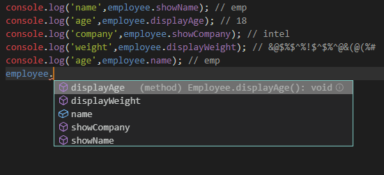

## 简述TS 的 class

请看以下代码

```typescript
class Person {
    public name: string;
    protected age: number;
    private weight: number;

    constructor(name: string, age: number, weight: number) {
        this.name = name;
        this.age = age;
        this.weight = weight;
    }

    showName() {
        this.showInfo(this.name);
    }

    private showAge() {
        this.showInfo(this.age);
    }

    private showWeight() {
        this.showInfo(this.weight);
    }

    protected showInfo(info: any) {
        console.log(info)
    }
}

class Employee extends Person {
    private company: string;

    constructor(name: string, age: number, weight: number, company: string) {
        super(name, age, weight);
        this.company = company;
    }

    public showCompany() {
        this.showInfo(this.company);
    }

    public displayAge() {
        this.showInfo(this.age - 5)
    }

    displayWeight() {
        this.showInfo('&@$%$^%!$^$%^@&(@(%#');
    }
}

const employee = new Employee('emp', 23, 166, 'intel');

console.log('name',employee.showName); // emp
console.log('age',employee.displayAge); // 18
console.log('company',employee.showCompany); // intel
console.log('weight',employee.displayWeight); // &@$%$^%!$^$%^@&(@(%#
console.log('name',employee.name); // emp
```



1. 如上图：编辑器提示我们employee变量只有showName、displayAge、showCompany、displayWeight、name五个属性
2. 继承：Employee类通过使用extends关键字来继承Person类
2. private关键字：Person 类中的private类型的属性和方法无法被Employee类访问，更无法被外界访问，所以我们在Employee类以及employee实例中无法访问Person类的showAge和showWeight方法以及weight属性
3. protected关键字：Person类中的protected类型的属性可以被Employee访问，但是无法被外界访问，所以我们在employee实例中无法访问age属性以及showInfo方法
4. public关键字：属性及方法默认为public，我们也可以显式的用public关键字来声明，public类型的属性和方法可以在被继承以及在实例中访问，所以我们employee中才会有showName、displayAge、showCompany、displayWeight、name五个属性
